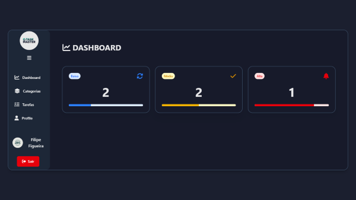
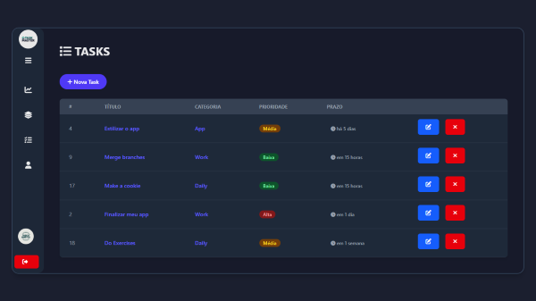
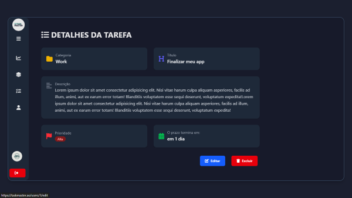
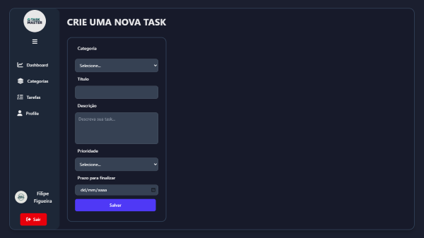
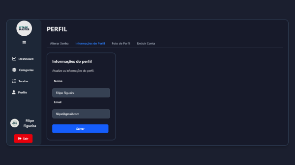
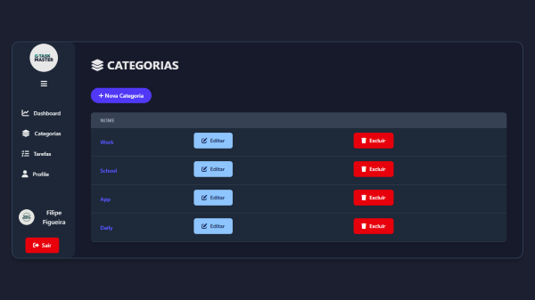

# TaskMaster

TaskMaster é uma aplicação web desenvolvida em **Laravel** para gerenciamento de tarefas, permitindo organização pessoal através de categorias, prioridades e perfis de usuário.  
O projeto foi pensado para ser simples, moderno e eficiente, com interface intuitiva.

---

## 🚀 Funcionalidades

- Autenticação de usuários (login, registo e perfil)
- CRUD de tarefas (criar, listar, atualizar e excluir)
- Organização por categorias
- Definição de prioridade (baixa, média, alta)
- Dashboard interativo
- Interface responsiva com Blade + TailwindCSS

---

## 🛠️ Tecnologias

- [Laravel 12.x](https://laravel.com/)
- [PHP 8.3](https://www.php.net/)
- [MySQL](https://www.mysql.com/)
- [TailwindCSS](https://tailwindcss.com/)
- [Blade](https://laravel.com/docs/blade)

---

## ⚙️ Instalação

1. Clone este repositório:
   ```bash
   git clone https://github.com/Filipe-Figueira/taskmaster.git
   ```

2. Entre no diretório do projeto:
   ```bash
   cd taskmaster
   ```

3. Instale as dependências do PHP:
   ```bash
   composer install
   ```

4. Copie o arquivo de configuração e gere a chave da aplicação:
   ```bash
   cp .env.example .env
   php artisan key:generate
   ```

5. Configure o banco de dados no arquivo `.env`.

6. Execute as migrações:
   ```bash
   php artisan migrate
   ```

7. Inicie o servidor de desenvolvimento:
   ```bash
   php artisan serve
   ```

---

## 📸 Capturas de Tela

<p align="center"> 
 <span>  
 </span>  
  
  
 
</p>  

---

## 📄 Licença

Este projeto está sob a licença [MIT](LICENSE).

---

## 👤 Autor

**Filipe Figueira**  
- GitHub: [@Filipe-Figueira](https://github.com/Filipe-Figueira)
